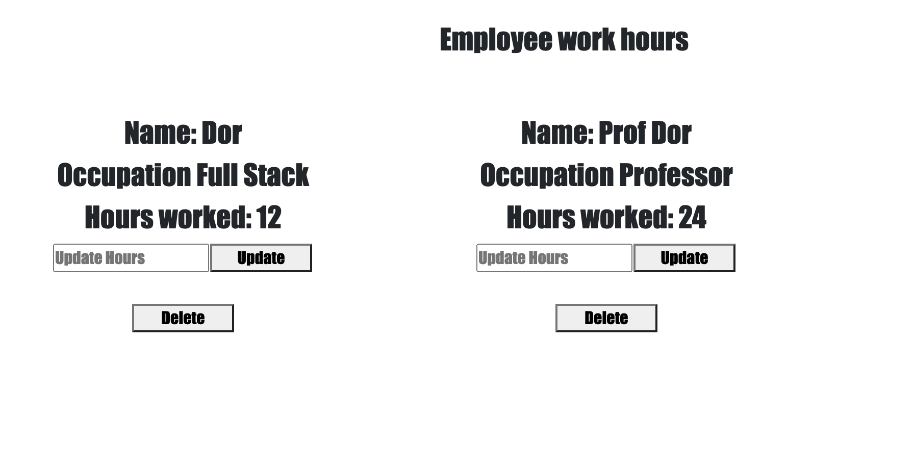
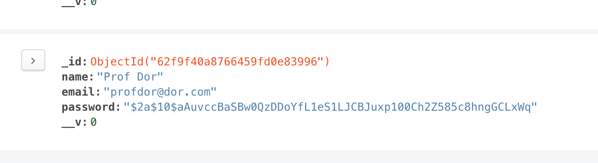
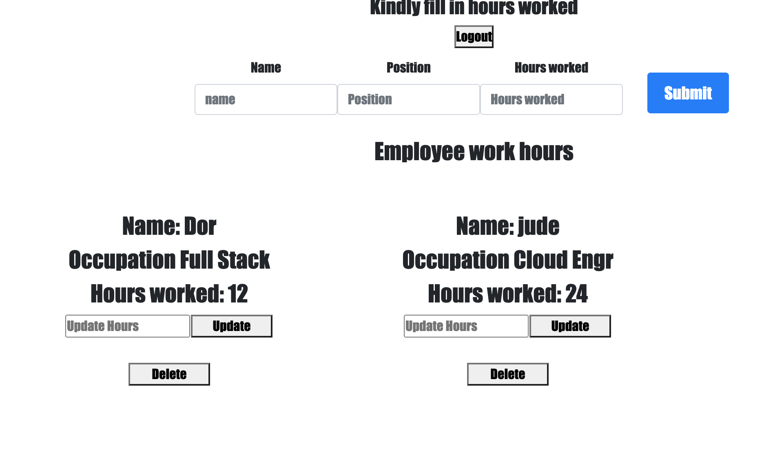
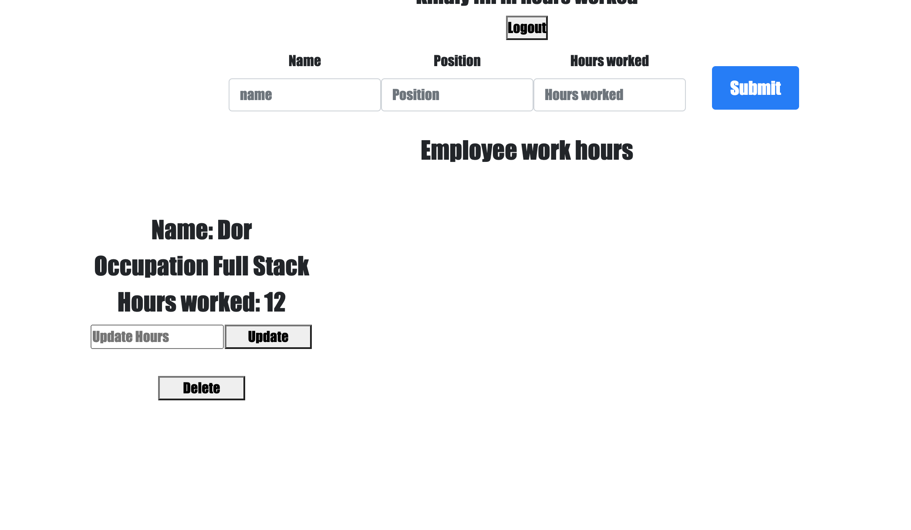

## FULL stack app MERN

### Client npm i, npm start PORT 3000

### Backend npm i, npm run dev PORT 5000

### FULL STACK MERN APP

[Trello Board Link](https://trello.com/b/Rjivpi9e/full-stack-app)

